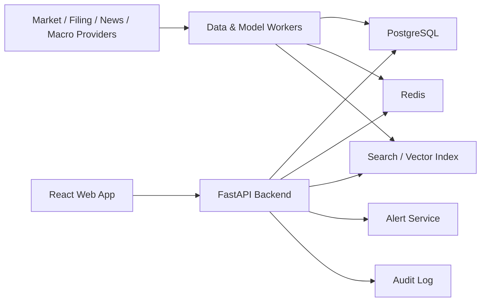

# Technical Architecture: Professional Stock Analysis Platform

## 1. Architecture Goal

Build a professional, data-backed stock analysis platform that can grow from a reliable MVP into a real-time research terminal. The architecture must support market data ingestion, financial statement analysis, news and event intelligence, recommendation scoring, model validation, portfolio risk, alerts, audit logs, and bilingual product output.

The first implementation should optimize for correctness, traceability, and professional usability before complex automation.

The recommendation universe is limited to the Chinese stock market. Version 1 should focus on mainland China A-shares. US stocks, Hong Kong stocks, China ADRs, and global equities should not appear in recommendation lists or stock detail pages unless the product scope is changed later.

## 2. Version 1 Architecture Decisions

| Area | Decision |
| --- | --- |
| Frontend | React + TypeScript |
| Backend API | Python FastAPI |
| Primary database | PostgreSQL |
| Cache / hot data | Redis |
| Background jobs | Python worker process, scheduled jobs, and queue-based tasks |
| Market data phase | Provider abstraction with delayed or near-real-time data depending on vendor access |
| Market scope | Mainland China A-shares only: Shanghai, Shenzhen, and Beijing exchanges |
| Model phase | Rule-based scoring first, interpretable ML later |
| Language | Default Chinese UI with `zh-CN` and `en-US` internationalization support |
| Deployment style | Docker-based local development, cloud-ready services later |
| Public advice boundary | Research decision-support with clear risk disclosure and audit trail |

## 3. High-Level System Map



## 4. Frontend Architecture

### 4.1 Main Application Areas

- Market overview.
- Recommendation center.
- Stock detail page.
- Industry and theme analysis.
- Watchlist and portfolio.
- Alerts.
- Data quality and admin.

### 4.2 Frontend Principles

- The first screen should be the professional dashboard, not a marketing landing page.
- Use dense but readable layouts: tables, charts, heatmaps, tabs, filters, and side panels.
- Do not hard-code user-facing text directly in components.
- All user-facing labels, table headers, alerts, recommendation explanations, and empty states must support i18n.
- Show data freshness and source status near market-sensitive data.
- Separate facts, analyst interpretation, and model output visually.

### 4.3 Suggested Frontend Structure

```text
frontend/
  src/
    app/
    pages/
      MarketOverview/
      RecommendationCenter/
      StockDetail/
      IndustryTheme/
      WatchlistPortfolio/
      AdminDataQuality/
    components/
      charts/
      tables/
      risk/
      recommendation/
      layout/
    i18n/
      zh-CN.json
      en-US.json
    services/
    types/
    utils/
```

### 4.4 Internationalization

Default language is Chinese (`zh-CN`). English (`en-US`) should be available through a language switcher.

Rules:

- Store UI strings in translation files.
- Store recommendation label translations in structured dictionaries.
- Keep financial formulas, ticker symbols, metric IDs, and source names language-neutral.
- Return backend explanations with a `locale` parameter where generated text is involved.
- Use bilingual-friendly data schemas so future markets can show local names and English names.

Example language behavior:

| User Setting | UI Labels | Recommendation Explanation | Stock Name Display |
| --- | --- | --- | --- |
| `zh-CN` | Chinese | Chinese | Local/common Chinese name when available, ticker always visible |
| `en-US` | English | English | English company name, ticker always visible |

## 5. Backend Architecture

### 5.1 Backend Responsibilities

- Serve normalized market, stock, financial, event, recommendation, risk, portfolio, and alert data.
- Enforce authentication and role-based access.
- Keep API responses traceable to data source and update time.
- Trigger recommendation recalculation when relevant inputs change.
- Store recommendation and model version history.

### 5.2 Suggested Backend Structure

```text
backend/
  app/
    main.py
    core/
      config.py
      security.py
      i18n.py
    routes/
      market.py
      stocks.py
      recommendations.py
      portfolios.py
      alerts.py
      admin.py
    schemas/
    models/
    repositories/
    services/
      market_data.py
      fundamentals.py
      filings.py
      events.py
      scoring.py
      risk.py
      portfolio.py
      audit.py
    workers/
    tests/
```

### 5.3 API Design Principles

- APIs should expose timestamps and source metadata with market-sensitive data.
- Recommendation APIs must include rating, horizon, confidence, risks, evidence, invalidation condition, source timestamps, and model/rule version.
- API responses should support `locale=zh-CN` and `locale=en-US` for generated explanations.
- Do not let frontend calculate core financial or recommendation logic.
- Use typed schemas for all external responses.

## 6. Data Architecture

### 6.1 Storage Types

| Storage | Purpose |
| --- | --- |
| PostgreSQL | Users, stocks, financial statements, recommendations, portfolios, alerts, audit logs |
| Redis | Latest quotes, hot dashboard data, rate limits, short-lived alert state |
| Object storage later | Raw filings, parsed reports, model artifacts |
| Search/vector index later | News, filings, report chunks, semantic evidence retrieval |

### 6.2 Core Data Entities

- User.
- Role.
- Stock.
- Exchange.
- Quote.
- HistoricalPrice.
- FinancialStatement.
- FinancialMetric.
- Filing.
- NewsEvent.
- SectorTheme.
- Recommendation.
- RecommendationEvidence.
- RiskSignal.
- Portfolio.
- Position.
- Alert.
- DataSource.
- DataFreshnessCheck.
- ModelVersion.
- AuditLog.

### 6.3 Data Freshness

Every major data group needs a freshness policy:

| Data | MVP Refresh Policy |
| --- | --- |
| Quote | Vendor-dependent; show delay clearly |
| Historical price | Daily after market close; intraday if available |
| Fundamentals | After filing or vendor update |
| News/events | Polling first, streaming later |
| Recommendations | Recalculate when input data changes |
| Portfolio risk | Recalculate after quote or position changes |

## 7. Data Ingestion Pipeline

### 7.1 Pipeline Stages

1. Fetch raw data from vendor or public source.
2. Store raw payload where appropriate.
3. Normalize symbols, timestamps, currency, exchange, and corporate actions.
4. Validate missing values and outliers.
5. Upsert normalized records.
6. Update freshness status.
7. Trigger scoring, risk, alert, or search indexing jobs.

### 7.2 Provider Abstraction

Each data provider should implement the same internal interface:

- `get_quote(symbol)`
- `get_historical_prices(symbol, start, end, interval)`
- `get_financials(symbol)`
- `get_filings(symbol)`
- `get_news(symbol_or_topic)`
- `get_macro_series(series_id)`

The system should be able to replace a vendor without rewriting business logic.

## 8. Recommendation Engine Architecture

### 8.1 V1 Engine

The first engine should be deterministic and explainable:

- Calculate factor scores.
- Apply weighting rules.
- Generate recommendation label.
- Generate risk flags.
- Generate thesis lifecycle state.
- Store input snapshot and version.

### 8.2 Score Components

- Fundamental quality score.
- Growth score.
- Valuation score.
- Momentum score.
- Event catalyst score.
- Risk score.
- Confidence score.

### 8.3 Recommendation Auditability

Every recommendation record must store:

- Rule/model version.
- Input data timestamp.
- Factor values.
- Final score.
- Label.
- Explanation.
- Risk flags.
- Source references.
- User or system actor.

## 9. Model And Backtesting Architecture

### 9.1 Model Progression

1. Rule-based scoring.
2. Backtested factor model.
3. Earnings surprise model.
4. Drawdown risk model.
5. Event-aware model.
6. Ensemble scenario model.

### 9.2 Backtesting Rules

- Use point-in-time data where possible.
- Prevent future data leakage.
- Include transaction costs.
- Include slippage.
- Segment by market regime.
- Store model version and backtest configuration.

### 9.3 Model Output Rules

Models should output scenario ranges and probability estimates, not certainty claims.

Required outputs:

- Expected return range.
- Downside estimate.
- Confidence.
- Key drivers.
- Model version.
- Validation status.

## 10. Alerts And Real-Time Layer

### 10.1 Alert Types

- Price threshold.
- Abnormal volume.
- Recommendation change.
- Risk score change.
- Filing or financial report update.
- News/event materiality update.
- Thesis invalidation trigger.
- Portfolio concentration warning.

### 10.2 Real-Time Strategy

MVP should use polling and cached updates. WebSocket or server-sent events can be added after core data quality works.

Real-time UI must show:

- Last update time.
- Data source.
- Delay status.
- Stale data warning.

## 11. Security, Compliance, And Audit

### 11.1 Security

- Use server-side secrets only.
- Do not expose vendor keys to frontend.
- Add role-based access for admin and analyst tools.
- Log important data and recommendation changes.

### 11.2 Compliance

- Show risk disclosure in Chinese by default.
- Store recommendation history.
- Store analyst overrides and reasons.
- Distinguish data facts from model forecasts.
- Require legal review before public investment-advice launch.

## 12. Development Phases

### Phase A: Documentation And Architecture

- PRD.
- Production workflow.
- Technical architecture.
- Data source decision.
- MVP user stories.

### Phase B: Project Scaffolding

- React frontend.
- FastAPI backend.
- PostgreSQL schema.
- Redis configuration.
- Basic Docker development environment.

### Phase C: Mock Data MVP

- Professional Chinese-first dashboard UI.
- Stock detail page.
- Recommendation center.
- Watchlist.
- Mock recommendation scoring.

### Phase D: Real Data Integration

- Market data provider.
- Fundamentals provider.
- Filing/news provider.
- Data freshness dashboard.

### Phase E: Recommendation And Risk

- Rule-based scoring.
- Risk flags.
- Recommendation history.
- Thesis lifecycle.

### Phase F: Backtesting And Modeling

- Backtest engine.
- Validation reports.
- Interpretable forecasts.

### Phase G: Alerts, Portfolio, And Hardening

- Portfolio risk.
- Alerts.
- Audit logs.
- Admin tools.
- Deployment hardening.

## 13. Acceptance Criteria For Architecture Completion

- The repo contains PRD, production workflow, implementation plan, and technical architecture.
- The architecture clearly identifies frontend, backend, data, recommendation, model, alert, i18n, audit, and deployment boundaries.
- Language requirements are explicit: Chinese default with English switch support.
- The next implementation step can scaffold the project without choosing core technologies again.
