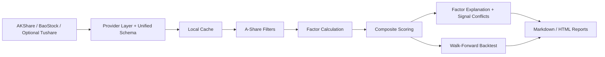
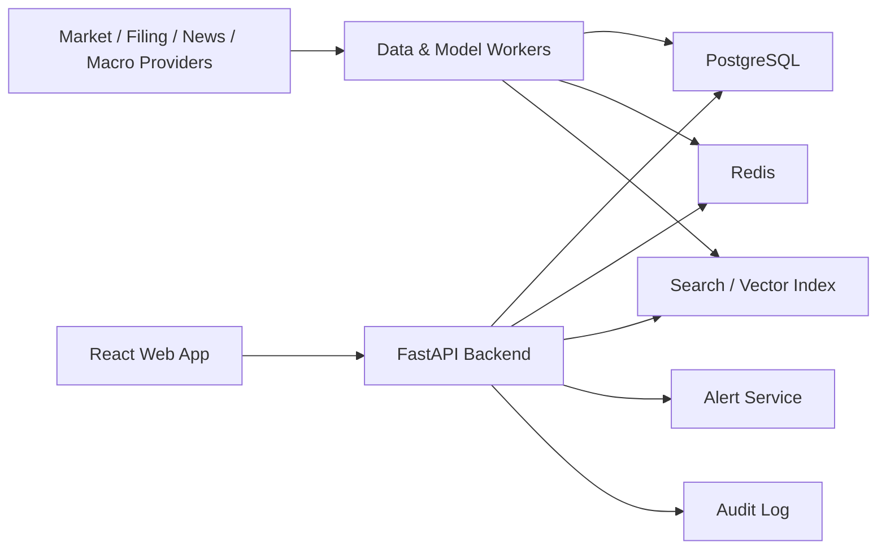

# Technical Architecture: Personal A-Share Research Terminal

## 1. Architecture Goal

Build a personal, data-backed A-share research terminal that can run after market close and produce candidate lists, explanations, reports, and backtest evidence.

The first implementation should optimize for correctness, traceability, reproducibility, and daily personal usability before web UI, real-time updates, or complex institutional infrastructure.

The recommendation universe is limited to the Chinese stock market. Version 1 should focus on mainland China A-share individual stocks. CSI 300, CSI 500, ChiNext Index, STAR 50, and industry indices should be used as benchmark context. ETFs are optional extensions. US stocks, Hong Kong stocks, China ADRs, and global equities should not appear in recommendation lists or stock detail pages unless the product scope is changed later.

## 2. MVP Architecture Decisions

| Area | Decision |
| --- | --- |
| Phase 1 runtime | Local Python research pipeline / CLI |
| Phase 1 update mode | Daily after market close |
| Phase 1 storage | Local file cache and normalized DataFrames |
| Phase 1 output | Markdown/html reports, CSV/JSON artifacts where useful |
| Frontend | Phase 2, React + TypeScript |
| Backend API | Phase 2, Python FastAPI |
| Primary database | Phase 2 or later, PostgreSQL when persistence needs outgrow local files |
| Cache / hot data | Local cache first; Redis later if dashboard or real-time needs require it |
| Background jobs | Local scheduled run first; worker queue later |
| Market data phase | Provider abstraction with daily data; no tick data in Phase 1 |
| Market scope | Mainland China A-shares only: Shanghai, Shenzhen, and Beijing exchanges |
| Analysis scope | A-share individual stocks first; CSI 300, CSI 500, ChiNext Index, STAR 50, and industry indices as benchmarks |
| ETF scope | Optional extension only |
| Prototype data source | AKShare and BaoStock first, Tushare Pro optional |
| Recommendation language | `候选关注`, `重点观察`, `观察`, `风险过高` |
| Model phase | Factor scoring and walk-forward backtesting first; advanced ML later |
| Language | Default Chinese UI with `zh-CN` and `en-US` internationalization support |
| Deployment style | Local personal workflow first; deployment later |
| Product boundary | Personal research only; no public investment advisory service |

## 3. Phase 1 System Map



## 4. Long-Term System Map



## 5. Frontend Architecture

Frontend is a Phase 2 concern. Do not build it before Phase 1 can generate useful daily research outputs.

### 5.1 Future Main Application Areas

- Market overview.
- Recommendation center.
- Stock detail page.
- Industry and theme analysis.
- Watchlist and portfolio.
- Alerts.
- Data quality and admin.

### 5.2 Frontend Principles

- The first screen should be the professional dashboard, not a marketing landing page.
- Use dense but readable layouts: tables, charts, heatmaps, tabs, filters, and side panels.
- Do not hard-code user-facing text directly in components.
- All user-facing labels, table headers, alerts, recommendation explanations, and empty states must support i18n.
- Show data freshness and source status near market-sensitive data.
- Separate facts, analyst interpretation, and model output visually.

### 5.3 Suggested Frontend Structure

```text
frontend/
  src/
    app/
    pages/
      MarketOverview/
      RecommendationCenter/
      StockDetail/
      IndustryTheme/
      WatchlistPortfolio/
      AdminDataQuality/
    components/
      charts/
      tables/
      risk/
      recommendation/
      layout/
    i18n/
      zh-CN.json
      en-US.json
    services/
    types/
    utils/
```

### 5.4 Internationalization

Default language is Chinese (`zh-CN`). English (`en-US`) should be available through a language switcher.

Rules:

- Store UI strings in translation files.
- Store recommendation label translations in structured dictionaries.
- Keep financial formulas, ticker symbols, metric IDs, and source names language-neutral.
- Return backend explanations with a `locale` parameter where generated text is involved.
- Use bilingual-friendly data schemas so future markets can show local names and English names.

Example language behavior:

| User Setting | UI Labels | Recommendation Explanation | Stock Name Display |
| --- | --- | --- | --- |
| `zh-CN` | Chinese | Chinese | Local/common Chinese name when available, ticker always visible |
| `en-US` | English | English | English company name, ticker always visible |

## 6. Backend Architecture

FastAPI is a Phase 2 concern. Phase 1 should expose reusable Python modules and CLI commands first.

### 6.1 Phase 1 Python Responsibilities

- Fetch and normalize daily A-share data.
- Cache market data.
- Filter the A-share universe.
- Calculate factors.
- Rank candidates.
- Explain factor contributions and signal conflicts.
- Generate markdown/html reports.
- Run walk-forward backtests.

### 6.2 Future FastAPI Responsibilities

- Serve normalized market, stock, financial, event, recommendation, risk, portfolio, and alert data.
- Enforce minimal local/personal access rules if needed later.
- Keep API responses traceable to data source and update time.
- Trigger recommendation recalculation when relevant inputs change.
- Store recommendation and model version history.

### 6.3 Phase 1 File Structure

```text
backend/
  src/stock_analysis/
    data/
    research/
    reports/
    backtesting/
    cli/
  tests/
```

See `PHASE1_TASKS.md` for the detailed task-level structure.

### 6.4 Future API Design Principles

- APIs should expose timestamps and source metadata with market-sensitive data.
- Recommendation APIs must include rating, horizon, confidence, risks, evidence, invalidation condition, source timestamps, and model/rule version.
- API responses should support `locale=zh-CN` and `locale=en-US` for generated explanations.
- Do not let frontend calculate core financial or recommendation logic.
- Use typed schemas for all external responses.

## 7. Data Architecture

### 6.1 Storage Types

| Storage | Purpose |
| --- | --- |
| Local file cache | Phase 1 daily bars and provider response caching |
| CSV/JSON/Markdown/HTML artifacts | Phase 1 research outputs and reports |
| PostgreSQL later | Phase 2+ persistent recommendations, history, watchlist, holdings |
| Redis later | Hot dashboard data or alerts if needed |
| Object storage later | Raw filings, parsed reports, model artifacts |
| Search/vector index later | News, filings, report chunks, semantic evidence retrieval |

### 6.2 Core Data Entities

- User.
- Role.
- Stock.
- Exchange.
- Quote.
- HistoricalPrice.
- FinancialStatement.
- FinancialMetric.
- Filing.
- NewsEvent.
- SectorTheme.
- Recommendation.
- RecommendationEvidence.
- RiskSignal.
- Portfolio.
- Position.
- Alert.
- DataSource.
- DataFreshnessCheck.
- ModelVersion.
- AuditLog.

### 7.3 Data Freshness

Every major data group needs a freshness policy:

| Data | MVP Refresh Policy |
| --- | --- |
| Daily bars | Phase 1: after market close |
| Benchmark indices | Phase 1: after market close |
| Fundamentals | Phase 3 |
| News/events | Phase 4 |
| Recommendations | Recalculate when input data changes |
| Portfolio risk | Phase 5 |

## 8. Data Ingestion Pipeline

### 7.1 Pipeline Stages

1. Fetch raw data from vendor or public source.
2. Store raw payload where appropriate.
3. Normalize symbols, timestamps, currency, exchange, and corporate actions.
4. Validate missing values and outliers.
5. Upsert normalized records.
6. Update freshness status.
7. Trigger scoring, risk, alert, or search indexing jobs.

### 7.2 Provider Abstraction

Each data provider should implement the same internal interface:

- `get_quote(symbol)`
- `get_historical_prices(symbol, start, end, interval)`
- `get_financials(symbol)`
- `get_filings(symbol)`
- `get_news(symbol_or_topic)`
- `get_macro_series(series_id)`

The system should be able to replace a vendor without rewriting business logic.

## 9. Recommendation Engine Architecture

### 8.1 V1 Engine

The first engine should be deterministic and explainable:

- Calculate factor scores.
- Apply weighting rules.
- Generate personal research candidate label.
- Generate risk flags.
- Generate thesis lifecycle state.
- Store input snapshot and version.

### 8.2 Score Components

- Fundamental quality score.
- Growth score.
- Valuation score.
- Momentum score.
- Event catalyst score.
- Risk score.
- Confidence score.

### 8.3 Recommendation Auditability

Every recommendation record must store:

- Rule/model version.
- Input data timestamp.
- Factor values.
- Final score.
- Label.
- Explanation.
- Risk flags.
- Source references.
- User or system actor.

Allowed Phase 1 labels:

- `候选关注`
- `重点观察`
- `观察`
- `风险过高`

## 10. Model And Backtesting Architecture

### 9.1 Model Progression

1. Factor scoring.
2. Walk-forward backtested factor model.
3. Drawdown and risk model.
4. Earnings surprise model later.
5. Event-aware model later.
6. Ensemble scenario model later.

### 9.2 Backtesting Rules

- Use point-in-time data where possible.
- Prevent future data leakage.
- Include transaction costs.
- Include slippage.
- Segment by market regime.
- Store model version and backtest configuration.

### 9.3 Model Output Rules

Models should output scenario ranges and probability estimates, not certainty claims.

Required outputs:

- Expected return range.
- Downside estimate.
- Confidence.
- Key drivers.
- Model version.
- Validation status.

## 11. Alerts And Real-Time Layer

Alerts and real-time updates are not Phase 1. Phase 1 uses daily after-close updates.

### 10.1 Alert Types

- Price threshold.
- Abnormal volume.
- Recommendation change.
- Risk score change.
- Filing or financial report update.
- News/event materiality update.
- Thesis invalidation trigger.
- Portfolio concentration warning.

### 10.2 Real-Time Strategy

MVP should use polling and cached updates. WebSocket or server-sent events can be added after core data quality works.

Real-time UI must show:

- Last update time.
- Data source.
- Delay status.
- Stale data warning.

## 12. Personal Boundary, Safety, And Audit

### 11.1 Security

- Keep provider tokens out of committed files.
- Do not expose vendor keys in reports.
- Log important data, scoring, and report generation changes where useful.

### 11.2 Compliance

- Show risk disclosure in Chinese by default.
- Store recommendation history.
- Store analyst overrides and reasons.
- Distinguish data facts from model forecasts.
- Avoid public investment-advice language.
- Treat outputs as personal research notes unless the product scope changes later.

## 13. Development Phases

### Phase 1: Daily A-Share Research Pipeline

- Data.
- Filters.
- Factors.
- Scoring.
- Explanations.
- Reports.
- Walk-forward backtests.

### Phase 2: FastAPI + Simple Dashboard

- React frontend.
- FastAPI backend.
- PostgreSQL schema.
- Redis configuration.
- Basic Docker development environment.

### Phase 3: Fundamentals, Valuation, Industry, And History

- Professional Chinese-first dashboard UI.
- Stock detail page.
- Recommendation center.
- Watchlist.
- Mock recommendation scoring.

### Phase 4: Events And Thesis Lifecycle

- Market data provider.
- Fundamentals provider.
- Filing/news provider.
- Data freshness dashboard.

### Phase 5: Personal Watchlist, Holdings, Risk, And Alerts

- Rule-based scoring.
- Risk flags.
- Recommendation history.
- Thesis lifecycle.

### Phase 6: Advanced Data, Models, Real-Time, And Deployment

- Backtest engine.
- Validation reports.
- Interpretable forecasts.

## 14. Acceptance Criteria For Architecture Completion

- The repo contains PRD, production workflow, implementation plan, and technical architecture.
- The architecture clearly identifies frontend, backend, data, recommendation, model, alert, i18n, audit, and deployment boundaries.
- Language requirements are explicit: Chinese default with English switch support.
- Phase 1 is clearly limited to daily research pipeline work.
- The next implementation step can build Phase 1 modules without choosing core boundaries again.
